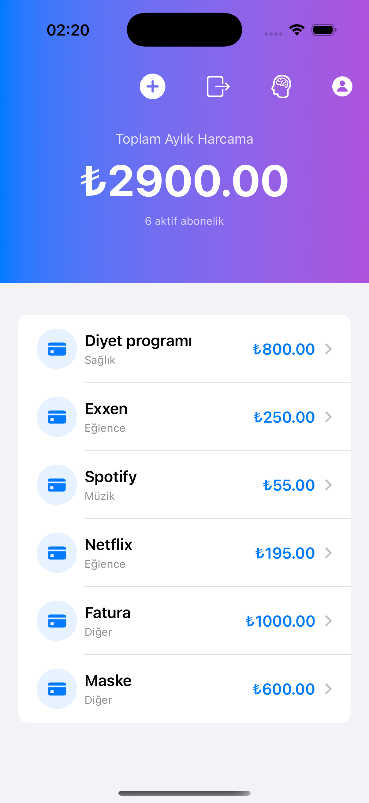
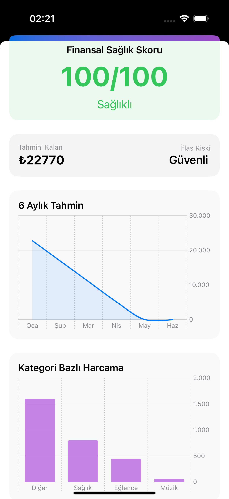
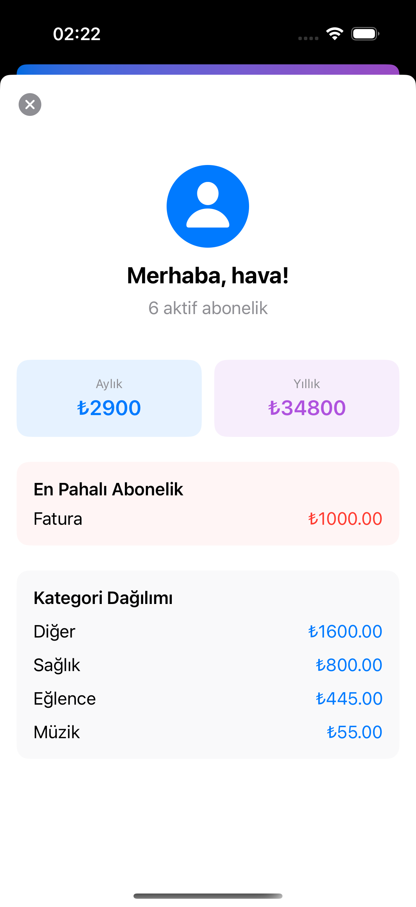

# FinanceFlow 💳

Personal finance and subscription manager with on-device machine learning.  
Built with SwiftUI, Firebase, and CoreML — trained in Python with scikit-learn.

---

## Features

- Subscription tracking with automatic category detection
- CoreML burn rate model predicts end-of-month balance
- Financial health score and bankruptcy risk analysis
- 6-month spending forecast with native Charts
- Payment day notifications
- Real-time sync with Firebase Firestore

## Machine Learning

The prediction model was trained using Linear Regression in Python, converted to `.mlmodel` with coremltools, and runs fully on-device. Takes monthly income, subscription costs, and previous spending as input.

## Tech Stack

SwiftUI · Firebase Auth · Firestore · CoreML · scikit-learn · Apple Charts

## Requirements

- Xcode 15+
- iOS 17+
- A Firebase project with Firestore enabled

## Getting Started

1. Clone the repo
```bash
   git clone https://github.com/havaacigse/FinanceFlow-App.git
```
2. Add your `GoogleService-Info.plist` to the `FinanceFlow/` folder
3. Open `FinanceFlow.xcodeproj` in Xcode
4. Select a simulator or device and press Run

## 📱 Screenshots

<p align="center">
  
  <br><br>
  
  <br><br>
  
</p>


